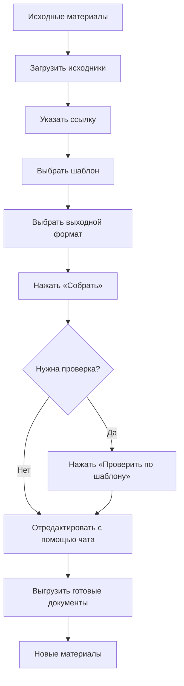

# UX-документация DocGen

Документ собран по итогам UX-интервью для задачи [№6](https://github.com/VasilyBrest/layout-agent/issues/6). Ответы ниже зафиксированы со слов респондента; дополнительные свойства пользователя и сценария не добавлялись.

## 1. Ответы UX-интервью

| Вопрос | Ответ |
| --- | --- |
| Кто основной пользователь? | «аналитики, документалисты и все» |
| В какой ситуации пользователь использует продукт? | Когда нужно быстро создать новый вид документа или конвертировать в новый формат |
| Какая у него проблема? | Рутинная работа занимает много времени |
| Какая задача пользователя? | Получить новый вид документа |
| Какой наблюдаемый результат нужен? | Новый вид документа, новый формат документа |
| Какая точка входа? | Исходные материалы |
| Какой успешный выход? | Новые материалы |
| Какие действия составляют путь? | Загрузить исходники, указать ссылку, выбрать шаблон, выбрать выходной формат, нажать «Собрать» или «Проверить по шаблону», отредактировать с помощью чата, выгрузить готовые документы |

## 2. Путь пользователя

Проверка по шаблону — альтернативная ветка после сборки: пользователь может сразу перейти к редактированию в чате или сначала проверить обязательные разделы.

## 3. Экраны

### Экран источников

Точка входа после открытия веб-приложения. Пользователь добавляет исходные материалы: загружает исходники и указывает ссылку. Здесь же отображается список добавленных источников и их готовность к сборке.

### Экран настройки сборки

Пользователь выбирает смысловой шаблон и выходной формат, после чего запускает действие «Собрать».

### Экран результата и предпросмотра

Показывает собранный документ в выбранной структуре. Пользователь использует его, чтобы понять, подходит ли результат, и перейти к проверке или уточнениям.

### Экран проверки по шаблону

Показывает результат проверки обязательных разделов и содержательных пробелов. Проверка запускается отдельным действием «Проверить по шаблону».

### Экран чата

Позволяет уточнять и редактировать результат сообщениями пользователя. После уточнения отображается обновлённая версия документа.

### Экран выгрузки

Содержит действие для скачивания готового документа в выбранном формате. Успешный результат — новые материалы.

## 4. Состояния экранов

| Экран / зона | Состояния |
| --- | --- |
| Источники | Пусто; загрузка; источники готовы; ошибка добавления источника |
| Настройка сборки | Можно собрать; сборка выполняется; ошибка сборки |
| Результат и предпросмотр | Черновик готов; предпросмотр загружается; предпросмотр доступен; ошибка предпросмотра |
| Проверка по шаблону | Проверка не запускалась; проверка выполняется; есть замечания; проверка завершена без замечаний; ошибка проверки |
| Чат | Ожидание ввода; сообщение отправляется; новая версия формируется; новая версия готова; ошибка уточнения |
| Выгрузка | Документ готов к скачиванию; файл формируется; скачивание доступно; ошибка формирования файла |

## 5. Критерий успешного сценария

Пользователь начинает с исходных материалов и заканчивает новыми материалами: получает новый вид документа или документ в новом формате, потратив меньше времени на рутинную работу.
