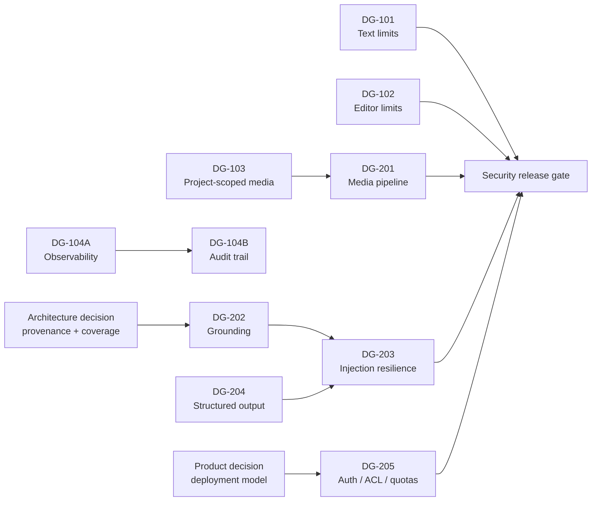

# Развитие DocGen

> Программа перехода от защищённого однопользовательского MVP к управляемому
> продукту с проверяемым AI-конвейером и явными границами доступа.

| Параметр | Значение |
| --- | --- |
| Статус | Active — готово к декомпозиции в engineering tasks |
| Базовая ревизия | `cfc65ba` (`main`, `demo-ready-2026-08-25`) |
| Последняя сверка с кодом | 3 сентября 2026 |
| Целевые ревьюеры | Security, AI Architecture, Product, Maintainer |
| Текущий контур | Однопользовательский MVP; не для публичного развёртывания |

> [!IMPORTANT]
> Предыдущий security review проводился для `820ab97`. После него код существенно
> изменился. Severity и статусы находок нельзя механически переносить на текущий
> `main`: перед релизом нужен повторный security review итогового commit.

## Цели программы

1. Закрыть подтверждённые риски истощения ресурсов и межпроектного доступа.
2. Сделать AI-сборку проверяемой: provenance, grounding, coverage и контроль
   структурированного выхода.
3. Довести media из DOCX, PDF и Confluence до редактора и экспорта без обхода
   project isolation.
4. Подготовить решение о целевом контуре: trusted single-user или
   multi-user с auth, ownership и ACL.

## Принципы

- **Code is the source of truth.** Любая задача повторно сверяется с её baseline.
- **Fail closed.** Невалидный вход, media reference или AI-ответ отклоняется.
- **No silent truncation.** Превышение лимита не даёт частичный результат.
- **State safety.** Отказ не меняет документ, revision, report или job result.
- **Least privilege.** Доступ к файлу и интеграции ограничен контекстом операции.
- **Small pull requests.** Один security property или один вертикальный slice на PR.

## Карта поставки

| ID | Приоритет | Результат | Влияние на логику | Шлюз |
| --- | --- | --- | --- | --- |
| DG-101 | P0 | Ранние лимиты TXT/Markdown | Input policy | Security review |
| DG-102 | P0 | Лимиты editor request/document | API policy | Security + regression |
| DG-103 | P0 | Project-scoped image loader | Access policy | Security review |
| DG-104 | P0 | Наблюдаемость и audit trail | Cross-cutting | Security + operations |
| DG-201 | P1 | Media pipeline DOCX/PDF/Confluence | Product behavior | Architecture + security |
| DG-202 | P1 | Строгий grounding | Core AI behavior | AI Architecture |
| DG-203 | P1 | Prompt-injection risk reduction | AI trust boundary | AI Architecture + security |
| DG-204 | P1 | Structured-output capability config | Provider compatibility | AI Architecture |
| DG-205 | Decision | Auth, ACL, Confluence access, quotas | Product architecture | Product + architecture + security |

## Этап 1 · P0 — защитный фундамент

### DG-101 · Лимиты TXT/Markdown

**Код:** `app/src/docgen/extraction/text.py`, `extraction/registry.py`, `config.py`.

Сейчас файл читается целиком; `splitlines()` и Markdown parser материализуют данные до
проверки общего лимита 150 виртуальных страниц.

**Результат:** до `splitlines()` и `MarkdownIt.parse()` проверяются символы, строки и
максимальная длина строки; во время построения контролируются число блоков и их объём;
таблицы имеют лимиты строк и столбцов. Превышение даёт `ExtractionError` без частичного результата.

**До реализации:** выбрать один точный набор дефолтов и единую семантику подсчёта пробелов.

### DG-102 · Лимиты editor request/document

**Код:** `app/src/docgen/editor/routes.py`, `editor/validation.py`,
`documents/operations.py`, `documents/edit_service.py`, `documents/repository.py`.

Текущий workspace limit равен `20_000_000` символов. Длина текста узла, элемента списка,
ячейки таблицы и `alt` не ограничена; `apply_operations()` выполняет deep copy до проверки результата.

**Результат:** потоковый body limit работает без доверия к `Content-Length`; JSON и form
покрыты одинаково; поля и сериализованный UTF-8 `WorkingDocument` имеют измеренные лимиты.
`413` используется для тела, `422` — для поля/результата, `409` сохраняется для revision conflict.

> [!WARNING]
> Дефолт 5–10 МБ нельзя вводить без измерения реального большого документа и сверки с
> существующим пределом 20 млн символов.

### DG-103 · Project-scoped image loader

**Код:** `app/src/docgen/export/html.py`, `export/docx.py`, `export/pdf.py`,
`jobs/worker.py`, `generation/routes.py`, `sources/storage.py`.

Текущий loader ограничивает traversal, но разрешает любой относительный путь внутри общего
`data_dir` и не знает `project_id`.

**Результат:** background export и synchronous conversion читают только media текущего
проекта; отклоняются другой проект, absolute path, `..`, backslash, symlink escape и
неизвестный source. Этот work package не добавляет извлечение новых картинок.

### DG-104 · Наблюдаемость и audit trail

Полная печать AI request/response уже удалена из `ai/client.py`. Остались защита от
регрессии, операционные метрики и аудит.

**DG-104A — observability:** correlation ID; `job_id`; scenario; provider/model; размеры;
число блоков; `finish_reason`; класс ошибки; retry count; duration. Обычные логи никогда
не содержат prompt, source/document text, response content, credentials или `Authorization`.

Диагностика задаётся одним режимом `DOCGEN_AI_DEBUG_MODE=off|masked|full`, по умолчанию
`off`. `full` запрещён в production profile. Для capture обязательны безопасные имена,
атомарная запись, каталог `0700`, файлы `0600`, `max_files` и `max_age_hours`.

**DG-104B — audit:** append-only события с UTC time, correlation ID, subject, action,
outcome, project/source/job ID и revision — без контента. До auth значение `anon` является
операционной корреляцией, а не доказательной идентификацией пользователя.

## Этап 2 · P1 — архитектурное развитие

### DG-201 · Media pipeline

**Подтверждённый разрыв:** DOCX не создаёт image blocks; PDF читает только text blocks;
Confluence держит attachment в `content_base64`; `enrich_images()` удаляет media reference;
`ImageExtractor` передаёт абсолютный путь.

**Целевой контракт:** единый media storage service получает `project_id`/`source_id`;
узел хранит непрозрачный `media_ref`; resolver всегда project-scoped; MIME проверяется по
содержимому; действуют лимиты bytes/pixels/count/total; source/project deletion очищает media.

Поставка вертикальными PR: storage/lifecycle → Confluence → DOCX/fidelity → PDF → end-to-end export.

### DG-202 · Строгий grounding

**Уже работает:** отклонение `finish_reason=length`, рекурсивное деление batch,
batch merge, section-ID validation и поиск непокрытых блоков.

**Оставшийся разрыв:** `GroundingValidator.validate()` удаляет `source_blocks` и проверяет
только gap. Нужно проверять известный block ID, точную непустую quote, locator и provenance
дочерних фактических узлов; непокрытые единицы повторно отправлять с лимитом попыток.

> [!CAUTION]
> `DocumentNode.provenance.source_id` сейчас фактически содержит `NormalizedBlock.id`, а не
> `Source.id`. Архитектор должен выбрать: документировать текущую семантику или разделить
> `source_id` и `block_id` с версионной миграцией.

Отдельное продуктовое решение: `lossless` требует покрытия каждой единицы; `summary`
разрешает опускать материал, но требует grounding каждого итогового утверждения.

### DG-203 · Снижение риска prompt injection

Source/document blocks помечаются как недоверенные данные во всех assemble/check/factual-chat
prompt builders. Инструкции, role/system tags, URL и поддельные схемы внутри них не должны
трактоваться как команды. Prompt не заменяет Pydantic/schema, section/rule-ID, operation
allowlist, grounding и revision checks.

Приёмка строится на adversarial fixtures: TXT, DOCX, Confluence HTML, скрытый текст,
поддельные system tags, section/rule ID и JSON schema. Выход либо проходит все
детерминированные проверки, либо отклоняется без изменения состояния.

### DG-204 · Structured-output capability

Текущая проверка `model.startswith("qwen")` смешивает имя модели с её возможностями.
Нужен явный `structured_output_mode=json_schema|plain_json` с обратно совместимым
дефолтом и обязательной локальной Pydantic validation в обоих режимах.

### DG-205 · Контур доступа, Confluence и квоты

Этот пакет заблокирован продуктовым решением о deployment model.

- Для trusted single-user deployment фиксируются сетевой периметр и принятое остаточное риск-состояние.
- Для multi-user нужны identity, project ownership, ACL на routes/jobs/exports, tenant quotas
  и выбранная модель Confluence credentials.
- Proxy identity без ownership/ACL полезен для аудита, но не защищает проекты.
- Quota check должен быть атомарным; схема «посчитать, затем записать» уязвима к race condition.
- Локальный compose должен публиковать `127.0.0.1:8000:8000`; Dokploy уже использует `expose`.

## Решения, необходимые до старта P1

| Решение | Владелец | Блокирует | Варианты |
| --- | --- | --- | --- |
| Семантика provenance | AI Architect | DG-202 | Текущий block ID / новая пара source+block |
| Режим полноты | Product + AI Architect | DG-202 | `lossless` / `summary` |
| Media reference | Architect + Security | DG-201 | Opaque `media_ref` |
| Deployment model | Product + Security | DG-205 | Trusted single-user / multi-user |
| Confluence credentials | Security + Product | DG-205 | Delegated / least-privilege service account |

Решение фиксируется коротким ADR до реализации зависимого work package.

## Модель поставки

Каждый PR должен содержать:

1. baseline commit и ссылку на work package;
2. security/architecture property, которую он вводит;
3. точные config defaults и user-visible ошибки;
4. unit, negative и regression tests;
5. migration и rollback, если меняются данные или env;
6. обновление этого документа при изменении scope/status.

### Definition of Done

- [ ] Scope соответствует одному work package или вертикальному slice.
- [ ] Не изменены несвязанные YAML templates, chat routing и UI scenarios.
- [ ] Ошибка не оставляет частичного состояния или orphan files.
- [ ] Нет секретов и полного пользовательского контента в logs, audit и fixtures.
- [ ] Новые лимиты конфигурируемы, измерены и проверены на boundary values.
- [ ] Целевые тесты, полный `pytest` и `ruff check` проходят.
- [ ] Для security-sensitive PR выполнено независимое review.
- [ ] Для DG-202–DG-204 получено AI Architecture approval.
- [ ] Перед релизом выполнен повторный security review итогового commit.

## Вне текущей программы

- изменение смысла YAML-шаблонов;
- агентная переделка chat intent routing;
- совместное редактирование и согласование документов;
- публикация обратно в Confluence;
- перенос SQLite queue/storage на промышленную многопользовательскую инфраструктуру без ADR.

## Журнал изменений

| Дата | Изменение |
| --- | --- |
| 2026-09-03 | Создан единый tracked roadmap; задачи сверены с `cfc65ba`; P0 и P1 разделены по риску и архитектурным зависимостям. |
